# Pulse

<p align="center">
  <picture>
    <source media="(prefers-reduced-motion: reduce)" srcset="assets/hero/hero-reduced.svg">
    <source media="(prefers-color-scheme: light)" srcset="assets/hero/hero-light.svg">
    
  </picture>
</p>

<p align="center">
  <picture>
    <source media="(prefers-reduced-motion: reduce)" srcset="assets/hero/computational-dark.svg">
    <source media="(prefers-color-scheme: light)" srcset="assets/hero/computational-light.svg">
    
  </picture>
</p>

Pulse is a universal human optimization OS that adapts nutrition, energy, recovery, focus, and daily performance recommendations to each person's real life in real time.

## Features

- Real-time state visualization (energy, focus, hydration, etc.)
- Personalized recommendations (what to do next)
- Daily timeline and history
- Lifestyle-based onboarding
- Premium dark UI with glassmorphism effects
- Settings and integrations management

## Tech Stack

- Next.js App Router
- React
- Tailwind CSS
- Supabase (auth/database)
- Vercel deployment

## Setup

1. Clone the repository
2. Install dependencies:
```bash
npm install
```
3. Create `.env.local` file:
```bash
# Required
NEXT_PUBLIC_SUPABASE_URL=your-supabase-project-url
NEXT_PUBLIC_SUPABASE_ANON_KEY=your-supabase-anon-key
NEXT_PUBLIC_SITE_URL=http://localhost:3000

# Required for email auth
NEXT_PUBLIC_SUPABASE_EMAIL_REDIRECT_URL=http://localhost:3000/auth/callback

# Optional analytics providers
NEXT_PUBLIC_POSTHOG_KEY=your-posthog-key
NEXT_PUBLIC_SEGMENT_KEY=your-segment-key
NEXT_PUBLIC_AMPLITUDE_KEY=your-amplitude-key
```

### Waitlist Setup

The waitlist feature requires the following database setup:

1. Create the waitlist table in Supabase using the migration file
2. Enable Row Level Security with public insert permissions
3. Create an index on the email column for faster lookups

### Analytics Setup

Pulse includes a lightweight analytics abstraction that supports multiple providers:

- PostHog
- Segment
- Amplitude
- Supabase (built-in)

To enable analytics, set the appropriate environment variables for your chosen provider(s).
4. Apply database migrations:
```bash
psql -U postgres -h your-supabase-db-host -d your-db-name -f migrations/20240401000000_initial_pulse_schema.sql
```
5. Run the development server:
```bash
npm run dev
```

## Contributing

We welcome contributions! Please open an issue or pull request on GitHub.
